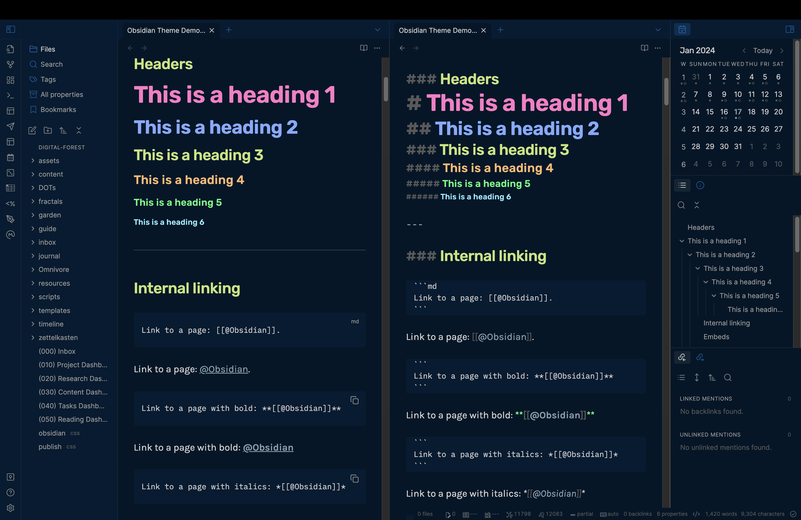

# Obsidian.md - Night Owl Theme

⚡ Inspired by the original [Night Owl theme](https://github.com/sdras/night-owl-vscode-theme) by [Sarah Drasner](https://twitter.com/sarah_edo).

## 📥 Installation

### Obsidian Marketplace (Recommended)

1. Open the **Settings** in Obsidian
1. Navigate to **Appearances** tab under **Options**
1. Under the **Themes** section, click on the `Browse` button next to **Community Themes**
1. Search for `Night Owl` in the Filter text input in the upper left corner
1. Click `Use` and then you're done! 🎉

### Manual

1. Download this repo
1. Copy the `obsidian.css` file into your vault's `/.obsidian/themes` directory
1. Rename the file to `Night Owl.css` so it will have a unique name in the theme selection dropdown
1. Open the **Settings** in Obsidian
1. Navigate to **Appearances** tab under **Options**
1. Under the **Themes** section, click on the dropdown menu next to **Theme** heading
1. Select for `Night Owl` and then you're done! 🎉

## FAQs

### How do I customize this theme?

#### Modify the `obsidian.css` file in your theme folder

⚠️ This is the simplest route, but it has its drawbacks in terms of sustainable change and possibly being overridden if you fetch updates to the theme.

1. Open your vault in a text editor (e.g., [VS Code](https://code.visualstudio.com/))
2. Open the theme's CSS file under `/.obsidian/themes/Night Owl.css`
3. Make whatever changes you want in there and then save!

#### Create a fork of this theme

This is arguably the most reliable route, but will require some familiarity with coding.

I recommend using [Node.js](https://nodejs.org/en/) so you can leverage the [Sass](https://sass-lang.com/) I'm starting to break out so you can make meaningful changes.

The Sass partials are will a work in progress though, so the way things are organized will probably change over time as I establish out better ways to structure how theming styles should be organized.

## Typography

### Preview Mode

When in preview mode, the typography is inspired by a dual font family system to easily distinguish between headings and regular text.

- Headings: [Rubik](https://fonts.google.com/specimen/Rubik)
- Body: [Karla](https://fonts.google.com/specimen/Karla)

### Editor Mode

When in edit mode, the typography is inspired from a developer like environment where you're "coding" your second-brain.

- [IBM Plex Mono](https://fonts.google.com/specimen/IBM+Plex+Mono)

## Credit

🎩 Hat tip to the [Dracula Obsidian Theme](https://github.com/jarodise/Dracula-for-Obsidian.md) for serving as the base theme I used to create this theme.
